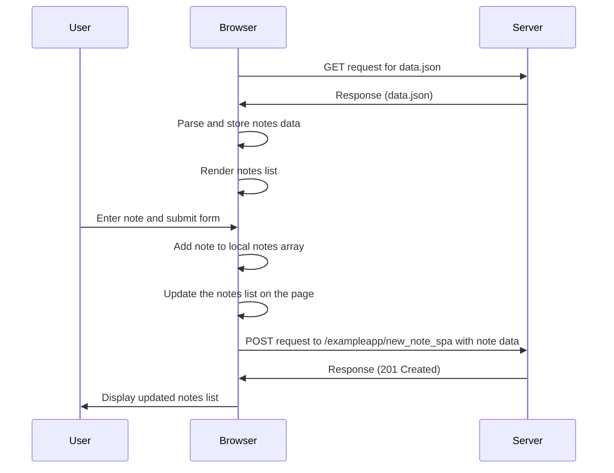

```mermaid
    sequenceDiagram
    participant User
    participant Browser
    participant Server

    Browser->>Server: GET request for data.json
    Server->>Browser: Response (data.json)
    Browser->>Browser: Parse and store notes data
    Browser->>Browser: Render notes list
    User->>Browser: Enter note and submit form
    Browser->>Browser: Add note to local notes array
    Browser->>Browser: Update the notes list on the page
    Browser->>Server: POST request to /exampleapp/new_note_spa with note data
    Server->>Browser: Response (201 Created)
    Browser->>User: Display updated notes list

```