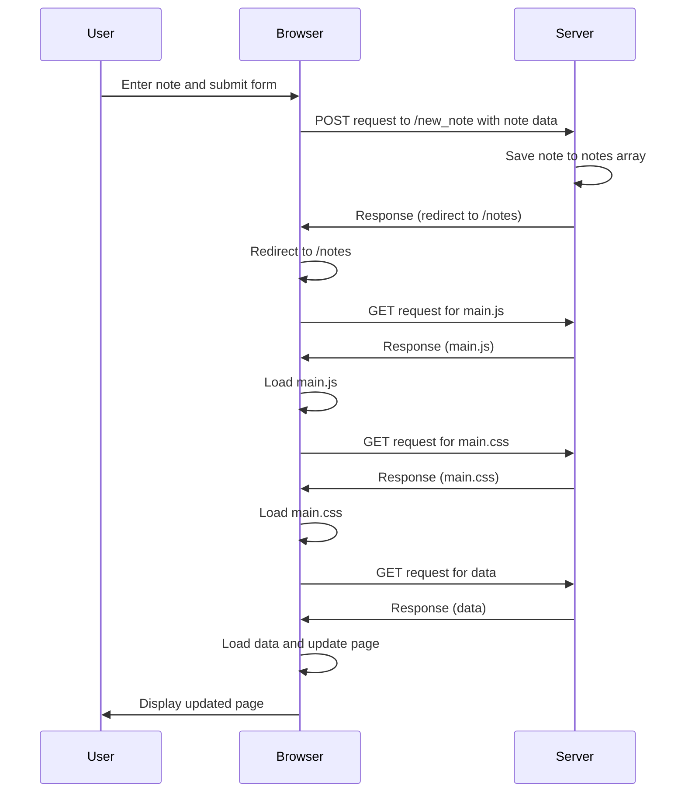

```mermaid
sequenceDiagram
    participant User
    participant Browser
    participant Server

    User->>Browser: Enter note and submit form
    Browser->>Server: POST request to /new_note with note data
    Server->>Server: Save note to notes array
    Server->>Browser: Response (redirect to /notes)
    Browser->>Browser: Redirect to /notes
    Browser->>Server: GET request for main.js
    Server->>Browser: Response (main.js)
    Browser->>Browser: Load main.js
    Browser->>Server: GET request for main.css
    Server->>Browser: Response (main.css)
    Browser->>Browser: Load main.css
    Browser->>Server: GET request for data
    Server->>Browser: Response (data)
    Browser->>Browser: Load data and update page
    Browser->>User: Display updated page

```